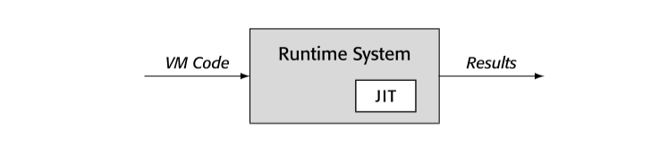

运行时优化已经被合并为一种让运行时系统更适应运行代码的技术。尤其是，通过将优化推迟到编译器获得更完整的比如类型，常数，运行时行为信息的阶段，JIT 编译器可以消除一些语言特性引入的开销，比如 OO，动态类型，延迟绑定。

运行时优化的基本原则：`运行时编译器必须节省比使用更多的 cycle`

与 AOT 编译器不同的是，AOT 编译器生成的代码每次编译后，会运行很多次。因此优化的开销占总时间比很小。AOT 应用各种转换，优化。终端用户对于编译和优化的开销感知很小。

总结，JIT 的约束意味着 JIT 开发者必须谨慎选择和实现转换。

## 14.2.1execution model



运行时系统可以通过执行原生代码，interpreting VM 代码，或者通过 JIT 编译 VM 代码到原生代码然后执行，生成结果。JIT，代码，以及运行时系统之间的关系决定执行模型。系统默认执行 native code 还是 VM code？哪个选择都有优劣：

- native-code 指定通常意味着在执行前调用 JIT 编译
- VM-code 执行通常意味着某些程度的 interpretation

native-code 执行通常比 VM-code 执行更快。native-code 以来硬件实现 fetch-decode-execute 循环，VM emulation 是软件实现。

另一方面，VM-code 系统启动时间更短，因为系统不需要编译。这会使得执行时间短的程序更快。对于很短的 procedure 或者很少执行的代码，JIT 编译时间可能就比运行时间还长。

JIT 引入到 VM-code 系统构建了混合模式。混合系统需要定位VM 以及 native ISA 格式的关键代码结构，比如 activation record。这种对偶表示可以引入 VM-code 结构和 native-code 结构的转换；这些转换反过来会增加运行时间。

native-code 执行，开销通过不同方式分布。将 VM-code 全部编译成 native-code，可以 AOT 或者 JIT；AOT 会在运行未优化代码时付出代价。JIT 方案会导致系统运行时编译，每次支持都会引入额外开销。

没有单一的方案适合所有设计。

## 14.2.2compilcation triggers

运行时系统必须决定 when and where 启动 JIT。这个决策会极大影响性能。

如果系统使用 JIT 编译所有代码，触发时机很简单，每个 procedure 第一次调用之前。如果系统只编译热代码，触发可能要求在 procedure-level 或者 block-level。native-code 环境以及混合环境可以使用不同方法收集 profile 数据。

在 native-code 环境，编译器开发者必须选择：

1. 将所有 VM code 编译成 native-code 再执行
2. 执行 AOT 编译好的代码，然后仅在 hot code 调用 JIT

略

## 14.2.3 Granularity of optimization （优化粒度）

- Hot Traces: trace 优化器追踪所有运行分支，发现热点路径，一旦这条路径运行次数超过阈值，系统调用 JIT 构建本路径的 native-code 生成。
  trace 优化器执行 local 以及 regional 优化，因为 trace 路径可能有 procedure 调用，regional 优化可以看作 AOT 中的 interprocedural 优化。 
- Hot Methods: method 优化器发现运行时占用时间长的 method，一旦 mehod 成为热点，系统使用 JIT 编译优化的 native-code
  因为在整个 method 上工作，优化可以执行比如 code motion，regional instruction scheduling，dead-code elimination，global redundancy elimination, strength reduction。有些还执行内联。

粒度的选择在优化开销和优化机会影响深远。

- trace 优化器可以应用 LVN 到整个 trace，发现冗余，折叠常数，简化标识符。大多数 method 优化器使用全局冗余算法，开销更大但是可能发现更多优化机会。
- trace 优化器可以使用最快的局部 register allocator。相反，method 优化器必须处理 control-flow，所以需要全局 register allocator 比如着色分配，或者线性扫描分配。

## 14.2.4 Sources of improvement

- Eliminate VM overhead ： 如果 JIT 在混合环境操作，转换降低了 emulation 的开销。native-code 使用硬件执行，提升了软件仿真的速度。
  有些早期的 JIT，比如 Thompson 在 QED 编辑器中关于正则表达式的 JIT，执行最小优化，几乎全部收益都来自 VM overhead 的消除
- Improve Code Layout：trace 优化器自然实现 code layout 的提升。因为它创建了 hot trace 的拷贝，替换执行序列中的 block
- Eliminate Redundancy：大多数 JIT 都会消除冗余。trace 优化器可以执行 LVN 或者 SVN 算法，可以执行常数传递，算术简化。
  method 优化器可以应用 DVNT 或者 data-flow 技术比如 lazy code motion 或者 global value-numbering algorithm 来实现类似收益。
- Reduce call overhead：内联优化可以消除调用开销。
- Tailor Code to the system：因为 JIT 编译的结果是临时的---执行结束会被删除---JIT 可以在运行时针对特殊处理器做优化。
  JIT 可能裁剪计算出 bound 的循环为有效 SIMD 硬件指令或者 GPU。
- Capitalize on Runtime Information：（评估运行时信息）比如 loop bound 可能需要从外存中读出，但是就不再改变。JIT 可以获取这个值提升代码性能。
  在延迟绑定的语言中，类型和类信息几乎不能在 AOT 编译器获取。JIT 可以利用运行时信息优化。尤其是，可以将通用方法转换为类特定调用。

JIT 编译加上了很多敏感的约束在优化上。比如传统 AOT 优化通常集中于 loop。因此比如 unrolling，loop-invariant code motion，strength reduction 这些已经被证明在 AOT 很有效的方法。Hot-trace 优化不能简单引入这些方法。

Control-flow 优化，比如 unrolling 或者 cloning，需要 CFG。很难从汇编中重构 CFG。如果代码使用 jump-to-register 操作，几乎不能知道真正的 target。在 IR 版本的代码中，分支 target 可以被重排。

【译者注：最后两段就是为了解释 AOT 和 JIT 的优化是不同的方向。】

## 14.2.5 Building a Runtime Optimizer

JIT 构建是一个工程问题。不需要新的理论或者算法。更需要的是谨慎的设计对于效率和可用性，以及最小开销。成功的 JIT 系统都源自设计决策的不断积累。

本章剩余部分说明运行时优化器出现的权衡。使用两个特定 case： hot-trace, hot-method 。

```markdown
小节回顾：
在 JIT 设计中，编译器开发者必须问自己几个关键问题：
必须选择一个执行模型：系统运行未优化的 emulation 还是 native-code？
必须选择优化粒度：trance 或者 method
必须选择编译触发时机：系统 when 优化代码
最后必须理解提升的来源，然后选择选择对于特定问题的优化。

通过设计实现的过程，编译器开发者必须权衡那个方面花更多时间：JIT 编译还是优化的执行时间。这些决策对于最后应用都有巨大影响。
```


