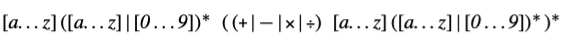
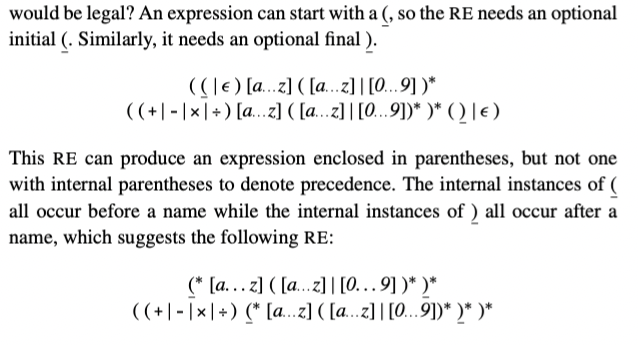
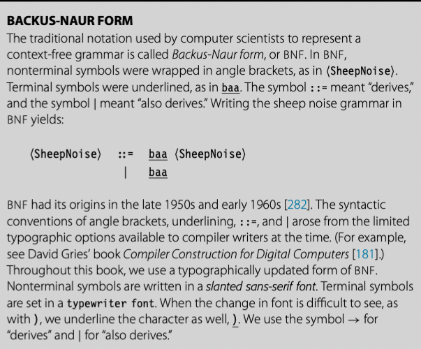

parser 的任务是确定某些单词流是否匹配 parser 预期的源语言语法。在这个描述中隐含的我们可以描述语法并检查它的概念；实际上我们需要符号来描述人们可能用于计算机编程语言的语法。在第 2 章中，我们使用这种符号，正则表达式。RE 可以精确的描述有限符号。RE 描述可以产生高效的识别器。不幸的是，RE 缺少描述大多数编程语言完整语法的能力。

对于大多数编程语言，语法用 CFG 表示。本节介绍 CFG 并探讨它们在语法检查中的使用。它展示了如何编码为语法和结构。最后，介绍了后面章节描述的高效解析技术的基本思想。

## 3.2.1 Why not use regular expressions?

为了表明为什么使用 CFG，考虑识别名称和运算符 \\(+, -, \times, \div \\)代数表达式问题。我们可以定义 "name" 匹配 `RE [a..z]([a..z]|[0..9])*`的字符串，简化的 algol identifier 小写字母版本。现在我们定义: 



这个 RE 匹配 \\(a + b \times c\\) 和 \\(e + f \div g\\)。RE 中没有操作优先级的概念，在 \\(a + b \times c\\) 中，哪个操作符先执行？是 \\(+\\) 还是 \\(\times\\) ？标准算术运算规则乘除先于加减。为了强制运算顺序，正常的算术表达式包含了括号。

我们可以在 RE 中中加入合法括号吗？



这个 RE 可以匹配 \\(a + b \times c 或者 (a + b)\times c\\)。可以匹配任意正确括号的名称和四个运算符的表达式。不幸的是，也可以匹配语法不正确的表达式比如 \\( a + (b \times c 或者 a + b)\times c \\)。事实上，我们不能写出一个 RE 来匹配配对的括号的表达式。（成对的结构，比如 `begin` 和 `end` 或者 `then` 和 `else`，在大多数编程语言中扮演了重要的角色）

无法匹配括号，无论是小括号，大括号还是 begin end 是 RE 的基本限制，相应的识别器无法计数，因为它们是有限状态集。实际上，DFA 无法计数。确实它可以在 microsyntax 工作的很好，但是不适合描述一些重要的编程语言特性。

## 3.2.2 Context-Free Grammars

为了描述编程语言语法，我们需要比 RE 更强大的符号。传统的方案是使用 CFG。幸运的是，CFG 很大一部分子类可以推导出高效识别器。



CFG，G 是规则集，或者 productions，描述如何组成句子。从 G 中派生出的句子的集合称为 defined by G，或者 L(G)。可以通过所有可能 CFG 定义的语言集被叫做 Context-free 语言集合。例子可能有助于理解。考虑下面的 grammar

```
SheepNoise -> baa SheepNoise
						| baa
```

第一个规则，或者 production，读到 SheepNoise 可以派生出 baa 跟随着另一个 SheepNoise。这里 SheepNoise 是一个语法变量，表示可以从 grammar 中派生的字符床集合。我们称这种语法变量为 nonterminal symbol。语言中比如 baa，是 terminal symbol。第二个规则是 SheepNoise 可以派生出 baa。

为了理解 SN grammar 和 L(SN) 的关系，我们需要制定如何使用 SN 中的规则派生 L(SN) 中的语句。首先我们需要确定 SN 的 start symbol。它表征 L(SN) 中的字符串集合。因此，它不能是语言中的单词。相反，必须是引入的 nonterminal symbol 之一，以增加语言的结构和抽象。因为 SN 只有一个 nonterminal symbol，SheepNoise 是 start symbol。

为了派生出语句，我们从包含 start symbol 原型字符串开始。然后重复下面的处理：（1）选择一个 nonterminal symbol \\( \alpha \\) （2） 选择 grammar 规则，\\( \alpha \rightarrow \beta \\) （3）使用 \\( \beta \\) 代替 \\( \alpha \\)。当原型字符串只包含 terminal symbol，派生停止。原型字符串就已经被重写为了语言中的语句。

派生中的每个点，原型字符串都包含了 terminal 和 nonterminal symbol 的序列。当这样的字符串作为有效派生的一个步骤出现时，是 sentential form。任何 sentential form 可以从 start symbol 在有限步骤内转换成。同样的，我们可以从任何 sentential form 在有限步骤转换成有效句子。
