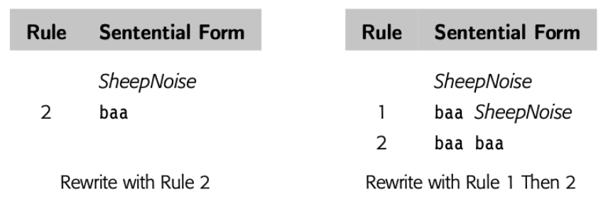
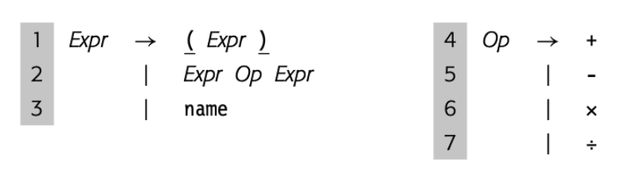
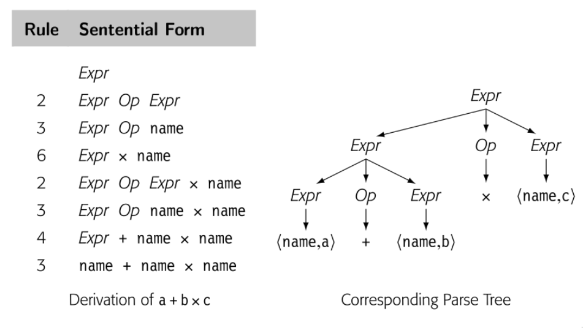
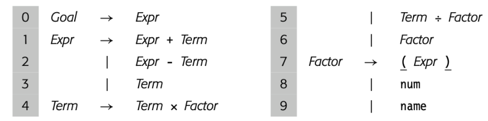
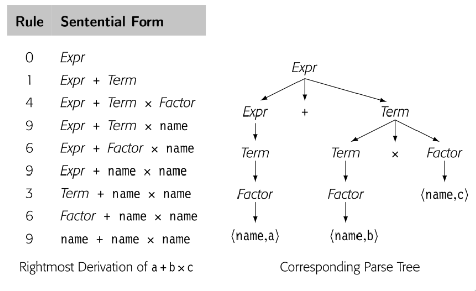

parser 的任务是确定某些单词流是否匹配 parser 预期的源语言语法。在这个描述中隐含的我们可以描述语法并检查它的概念；实际上我们需要符号来描述人们可能用于计算机编程语言的语法。在第 2 章中，我们使用这种符号，正则表达式。RE 可以精确的描述有限符号。RE 描述可以产生高效的识别器。不幸的是，RE 缺少描述大多数编程语言完整语法的能力。

对于大多数编程语言，语法用 CFG 表示。本节介绍 CFG 并探讨它们在语法检查中的使用。它展示了如何编码为语法和结构。最后，介绍了后面章节描述的高效解析技术的基本思想。

## 3.2.1 Why not use regular expressions?

为了表明为什么使用 CFG，考虑识别名称和运算符 \\(+, -, \times, \div \\)代数表达式问题。我们可以定义 "name" 匹配 `RE [a..z]([a..z]|[0..9])*`的字符串，简化的 algol identifier 小写字母版本。现在我们定义: 


这个 RE 匹配 \\(a + b \times c\\) 和 \\(e + f \div g\\)。RE 中没有操作优先级的概念，在 \\(a + b \times c\\) 中，哪个操作符先执行？是 \\(+\\) 还是 \\(\times\\) ？标准算术运算规则乘除先于加减。为了强制运算顺序，正常的算术表达式包含了括号。

我们可以在 RE 中中加入合法括号吗？


这个 RE 可以匹配 \\(a + b \times c\\) 或者 \\((a + b)\times c\\)。可以匹配任意正确括号的名称和四个运算符的表达式。不幸的是，也可以匹配语法不正确的表达式比如 \\( a + (b \times c\\) 或者 \\(a + b)\times c \\)。事实上，我们不能写出一个 RE 来匹配配对的括号的表达式。（成对的结构，比如 `begin` 和 `end` 或者 `then` 和 `else`，在大多数编程语言中扮演了重要的角色）

**无法匹配括号，无论是`(), {}`还是 `begin end` 是 RE 的基本限制**，相应的识别器无法计数，因为它们是有限状态集。\\( (^n )^n \\)不是 regular。原则上，DFA 无法计数。确实它可以在 microsyntax 工作的很好，但是不适合描述一些重要的编程语言特性。

## 3.2.2 Context-Free Grammars

为了描述编程语言语法，我们需要比 RE 更强大的符号记法。传统的方案是使用 CFG。幸运的是，CFG 很大一部分子类可以推导出高效识别器。

> BACKUS-NAUR Form
>
> 计算机科学表示 context-free grammar 的传统记法是 *Backus-Naur form*,或者 *BNF*. BNF 中, nonterminal symbols 使用尖括号括起来,\<SheepNoise\> Terminal symbols 使用下划线表示，<u>baa</u> . `::=`  表示 derive，`|` 表示也 derive
>
> \<SheepNoise\> ::= <u>baa</u> \<SheepNoise\>
> ​								| <u>baa</u>
>
> BNF 诞生于 1950末，1960初。尖括号，下划线，双冒号等于，竖线来资源当时编译器编写可选的有限的符号。本书中，我们使用 BNF 更新的印刷形式。斜体表示 Nonterminal symbol，印刷黑体表示 Terminal symbols，-> 表示 derive

CFG，G 是规则集，或者 productions，描述如何组成句子。**从 G 中派生出的句子的集合称为 defined by G，或者 L(G)**。可以通过所有可能 CFG 定义的语言集被叫做 Context-free 语言集合。例子可能有助于理解。考虑下面的 grammar

```
SheepNoise -> baa SheepNoise
						| baa
```

第一个规则，或者 production，读到 SheepNoise 可以派生出 baa 跟随着另一个 SheepNoise。这里 SheepNoise 是一个语法变量，表示可以从 grammar 中派生的字符床集合。我们称这种语法变量为 nonterminal symbol。语言中比如 baa，是 terminal symbol。第二个规则是 SheepNoise 可以派生出 baa。

为了理解 SN grammar 和 L(SN) 的关系，我们需要制定如何使用 SN【译者注：就是上面的 SheepNoise】 中的规则派生 L(SN) 中的语句。首先我们需要确定 SN 的 start symbol。它表征 L(SN) 中的字符串集合。因此，它不能是语言中的单词。相反，必须是引入的 nonterminal symbol 之一，以增加语言的结构和抽象。因为 SN 只有一个 nonterminal symbol，SheepNoise 是 start symbol。

> Context-free grammars
>
> 形式上，context-free grammar ***G*** 包括四部分 <T,NT,S,P>
>
> T: L(G) 语言中 termial symbols 集合。Terminal symbols 与 scanner 返回的句法分类关联
>
> NT: nonterminal symbols 集合。句法变量，由 productions of G 定义来提供抽象和结构
>
> S: nonterminal symbol 作为 start symbol 或者 global symbol。S 表示 L(G) 中的句子集合
>
> P: G 中的 productions 集合或者重写规则。P 中的每条规则有这样的格式 \\(NT \rightarrow (T \cup NT)^+\\) ；就是通过一个或者多个 grammar 字符串替代单个 nonterminal
>
> T 和 NT 可以直接从 productions 派生。start symbol 可能不清楚，比如在 SheepNoise grammar中，也可能不明显，比如下面的
>
> ```bash
> Paren -> ( Bracket )               Bracket -> [ Paren ]
> 				| ( )                                 | [ ]
> ```
>
> 这个例子中，start symbol 选择决定了哪个是外边的括号。
>
> 有些工具要求 S 不能出现在 productions 后边，方便确定 S

为了派生出语句，我们从包含 start symbol 原型字符串开始。然后重复下面的处理：（1）选择一个 nonterminal symbol \\( \alpha \\) （2） 选择 grammar 规则，\\( \alpha \rightarrow \beta \\) （3）使用 \\( \beta \\) 代替 \\( \alpha \\)。当原型字符串只包含 terminal symbol，派生停止。原型字符串就已经被重写为了语言中的语句。

> Derivation
>
> 重写步骤的序列：开始于 grammar 的 start symbol ，变成语言中的句子终止

> Sentential form
>
> symbols 的字符串，一次有效 derivation 中的一步

派生中的每个点，原型字符串都包含了 terminal 和 nonterminal symbol 的序列。当这样的字符串作为有效派生的一个步骤出现时，是 sentential form。任何 sentential form 可以从 start symbol 在有限步骤内转换成。同样的，我们可以从任何 sentential form 在有限步骤转换成有效句子。因此如果我们从 SheepNoise 开始，使用两条规则覆写，每一步都是 sentential form。当我们达到字符串只包含 terminal symbols，这个字符串就是 L(SN) 中的句子。

为了 derive SN 的句子，我们从包含 SheepNoise 的字符串开始，如果我们使用规则 2 ，变成 baa，不用继续覆写。所以 baa 就是 L(SN) 中有效的句子；或者使用规则 1，baa SheepNoise ，这个字符串还包含 nonterminal，继续使用规则2 ，baa baa ，也是 L(SN) 中有效的句子。如下图所示



我们使用 \\( \rightarrow^+ \\) 表示一步或者多步 derive。因此  \\( SheepNoise \rightarrow^+ baa \\) 以及  \\( SheepNoise \rightarrow^+ baa baa \\) 

规则 1 加长句子，规则 2 消除 nonterminal，SN 的所有 derivation 都是0或者多次使用规则1，然后使用规则2.

注意到 L(SN) 可以通过 \\( (baa)^+\\) 这个 RE 表示，所以 L(SN) 是 regular 语言。

## 3.2.3 More Complex examples

omit

## 3.2.4 Encoding meaning into structure

上一节的 if-then-else 歧义指出 grammar 结构和意义之间的关系。然而，不止歧义性属于意义和结构互相影响。看下面的例子





一个自然的计算表达式的方法就是遍历后续树。首先计算 a + b 然后乘 c 。这个方法是违反了代数规则。因为 parse 表达式最终的目标是产生实现的代码，这个表达式 grammar 应该有这种特性，“自然”遍历树产生正确结果。

真正的问题在于上面的 grammar 将所以代数操作一视同仁，忽略了优先级。最右 derivation 和最左 derivation 生成了不同的 parse tree。所以语法是有歧义的。这个简单的表达式 grammar 需要三层优先级：() 最高 ，乘和除次之，加减最后。然后我们将操作符分组来区分层级，使用 nonterminal 来区分 grammar 不同的部分。





现在，语法没有了歧义。这个改变影响了 derivation 的长度和解析树的大小。

## 3.2.5 Discovering a derivation for an input string

我们已经看到又了 G 如何生成 L(G) 。不过，parser 是接受输入的字符串，表示是 L(G) ，发现 derivation。从给定输入序列找到 derivation 称为 parsing。

parser 看到的是 scanner 处理过的流，因此 parser 看到的 \\\(a + b \times c\\) 是 \\(<name, a> + <name, b> \times <name, c>\\) 。作为输出，parser 应该输出 derivation 或者错误信息。

将 parser 视为构建 parse tree 的过程很有帮助。parse tree 的根已知，就是 start symbol，叶子结点就是 scanner 给出的 token 们，最困难的部分就是如何连接 root 和 leaf。两种方法：

1. top-down parsers： 从根开始，生长树到叶子结点。每一步，top-down parser 根据 nonterminal 找到一个节点，然后扩展成子树表示 production 右侧来覆写 nonterminal
2. Bottom-top parsers 从叶子开始，生长树到根。每一步，bottom-top parser 找到匹配 production 右侧的上层的子串，然后建造规则的左侧，连接到树上。
