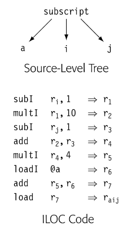

编译器使用多种 IR。我们关于 IR 的讨论为三个方面：组织结构，抽象层次，使用模式。通常来说，这三个属性是独立的；组织/抽象/命名在编译器中组合使用。

## 组织结构

广义来说，IR 分为三类：

**Graphical IRs**：将编译器获得的信息编码成图。在节点和边上操作。第三章中的解析树也是图 IR 的一个实例，如下图

**Linear IRs**: 对于某些抽象机的汇编伪码。迭代线性序列操作的算法。本书使用的 ILOC 代码就是一种 Linear IR。如下图

**Hybrid IRs**: 组合图和线性 IR 的元素，扬长避短。经典控制流图 CFG 使用 linear IR 表示代码块，使用图表示控制结构。

IR 的组织结构对于编译器开发者如何分析，优化，代码生成的思考有强烈的影响。比如，树结构的 IR 天然组织为树遍历。类似线性 IR 天然按序迭代。

## 抽象层次

编译器开发者必须选择 IR 的抽象层次。IR 可以组织为接近源码的形式，其中几个节点表示一个数组的访问，或者一个过程调用的低层次形式，其中合并多个 IR 操作组成单个机器指令。为了说明可能性，如图表示 `a[i,j]` ，上面是源码树表示，下面是 ILOC 表示。

源码树表示中，编译器可以轻易识别数组引用的计算，ILOC 形式就很困难做到同样的事。当编译器试图比较两个数组引用是否引用同一块内存，源码树更容易做到。另一方面，如果目标是优化最后的代码生成，ILOC 代码可以让编译器优化源码树中隐藏的细节，这个场景中，低层次的 IR 更合适。

不同的抽象层次是独立的结构。抽象层次很重要，因为编译器通常只能优化 IR 表示的细节。隐藏在 IR 中的事实很难被改变，因为编译器统一【忽略】隐式知识，减轻上下文自定义。比如，为了优化数组引用，编译器必须重写引用的 IR，如果引用的细节是隐式的，编译器无法修改它们。

## 使用模式

第三个纬度是编译器使用 IR 的方式。

**Definitive IR**： *definitive* IR 是被编译代码的主要表示。编译器不会回去参考文本源码，只会分析，转换 IR 版本的代码。这些 IR 是 definitive IR

**Derivative IR**: *derivative* IR 是编译器为了临时目的建立的。derivative IR 会膨胀 definitive IR，例如用于指令调度的依赖图。编译器使用 derivative IR 完成特定优化。

通常来说，如果 IR 需要从一个阶段传递到另一个阶段，应该是 definitive IR。如果 IR 是在阶段内建立，一般是 derivative IR。

## 命名

编译器开发者必须为 IR 选择一个命名空间。那些变量会暴露的决策会影响优化。比如，在转换源码时，编译器必须选择名字和值的存储位置。

使用太少的名字会抑制优化，但是太多的名字会增加无谓的编译时间。4.6 会讨论这个问题

## 实际的考虑

作为一个实际问题，IR 的生成和操作应该为编译器开发者关心，因为这直接影响了编译器的速度。不同 IR 对于数据空间的要求也是迥然不同。因为编译器可以访问分配的所有空间，数据空间直接与运行时相关。

最后但是很重要的是，编译器开发者应该考虑 IR 的表达能力。表示 procedure 的 IR 可能包含了定义它的代码，静态分析结果，之前执行的 profile 数据，以及让 debugger 理解代码和数据的映射。所有这些信息应该在 IR 某个点清晰的表达出来。

