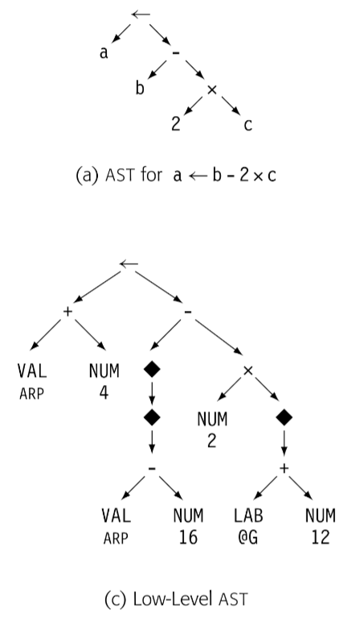
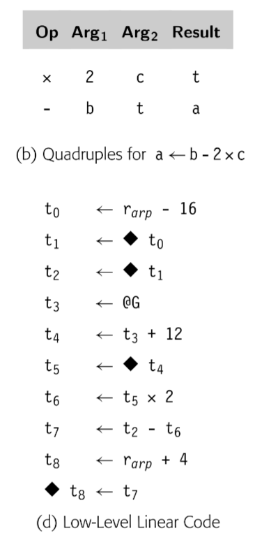

编译器使用多种 IR。我们关于 IR 的讨论为三个方面：组织结构，抽象层次，使用模式。通常来说，这三个属性是独立的；组织/抽象/命名在编译器中组合使用。

## Structural Organization

广义来说，IR 分为三类：

**Graphical IRs**：将编译器获得的信息编码成图。在节点和边上操作。第三章中的解析树也是图 IR 的一个实例，如下图

**Linear IRs**: 对于某些抽象机的汇编伪码。迭代线性序列操作的算法。本书使用的 ILOC 代码就是一种 Linear IR。如下图

**Hybrid IRs**: 组合