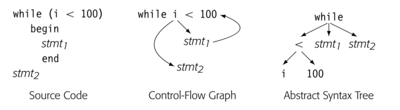

很多编译器使用图作为 IR 表示代码。所有的图 IR 都包含点和边，不同之处在于抽象程度，图与真实代码的关系，和图结构。

## 4.3.1 Syntax-Related Trees

Parse trees, ASTs, and directed acyclic graphs(DAGs) 是所有用来表示代码的图。这些类树 IR 的结构都关联了源代码的语法。

### Parse trees

parse tree 强关联于文本代码，因为表征了完整的 derivation，一个 node 表示一个 derivation 过程中的 grammar symbol。因为编译器必须为每个节点，每条边分配内容空间，所以在编译过程中必须遍历所有节点和边，所以值得考虑如何精简 parse tree。

更有效率的精简方式就是将编译器后续没有真正使用目的的节点抽象，这种方法会得到简化版本的 parse tree，通常被称为 abstract syntax tree.

**使用模式**：parse tree 通常只被用于在 attribute-grammar 系统中讨论 parsing，它是一种 definitive IR。在大多数其他需要源码树的应用中，编译器开发人员会倾向于它的变体，比如 AST 或者 DAG

### Abstract Syntax Trees

AST 保留了 parse tree 的结构和信息，只删除了无关紧要的节点（non-ternimal symbol）

**使用模式**：ASTs 在很多实际的编译器中作为 definitive IR，这个层级的抽象应用广泛：

- 源码转源码系统，包括 syntax-directed editors, code refactoring tools, automatic parallelization systems, 通常将 AST 用作接近源码的抽象，反映了源码的结构
- 生成 assembly code 的编译器也可能使用 AST，这些系统通常开始于近源码程度的 AST 然后转换为更低程度的抽象，直到达到机器码级别，最后低层级的 AST 反应操作数的 flow

有些编译器建立 AST 因为有助于简化某些算法。尤其是，重排表达式，因为 AST 没有所有中间结果的显示名称。其他算法，比如 tree-balance 或者 tree-pattern matching 有着“天然的”树结构表达式。

### Directed Acyclic Graphs

`A DAG is an AST that represents each unique subtree once. DAGs are often called ASTs with sharing.`

尽管 AST 已经比 parse tree 简洁了很多，但是还是保留了源码的结构。比如，`a x 2 + a x 2 x b` 包含了两个 `a x 2` 表达式。 DAG 就是 AST 消除了重复的结果。DAG 中节点可以有多个父亲节点，有些子树会被重复使用。DAG 就会比 AST 更压缩。

DAG 显式消除了公共子表达式。

**使用模式**：DAGs 在真实系统中主要有两个主要原因。编译器运行的内存限制，使用 DAG 作为 IR 可以减少内存空间占用。其他系统使用 DAG 消除冗余，比如使用 DAG 作为 derivative IR，建立 DAG，将 definitive IR 消除冗余，删除 DAG。

## 4.3.2 Graphs

树结构可以天然表征源码的 grammatical 结构同时，严格的结构使得在表示程序某些特性的时候有所不足。为了对程序的这些行为建模，编译器使用其他图结构作为 IR

### Control-flow Graph

control flow 最简单的单元是 basic block -- 最大长度的无分支序列。一个 block 的操作总是一起执行，除非有些操作抛出异常。block 开始于 labeled operation，结束于 branch，dump 或者 predicated operation。Control 在第一个操作进入 basic block。在 block 中按序从上到下执行 operation。

CFG 建模了 procedure 中 basic block 的控制流。CFG 是有向图 G=(N,E)。

为了后续章节 8， 9 关于程序分析的简化，我们假设 CFG 有单一入口和单一出口。

CFG 提供了运行时可能的控制流路径的图表示。不同于 synatx-oriented IR，比如 AST 表征了 grammatical structure。

比如上图 CFG 获取了循环的本质，AST 获取的语法，可以通过其重建循环的源码。

**使用模式**：编译器通常使用 CFG 关联另一种 IR。CFG 表达了 blocks 之间的关系，blocks 内部的 operation 可以通过关联的 IR 获取，比如表达式级别的 AST，DAG 以及某种线性 IR。

编译器很多部分隐式或显式使用 CFG。为了优化的程序分析一般开始于 CFG 分析。[intruction schedulers](./12.instruction_scheduling.md) 需要 CFG 理解调度好的指令流。[register allocation](./13.register_allocation.md) 需要 CFG 理解每个 operation 可能的执行频率以及在哪里插入 load 和 store 指令。

#### Block Length

有些作者推荐 CFG 的 block 尽可能短（比如一个 stmt 就是一个 block）-> single-statement blocks，也可以简化分析和优化的算法。

建立哪种 Block 的 CFG 是关于空间和时间的权衡。ssb 版本的 CFG 会有更多的节点和边，因此 ssb 比 bb 版本更占空间，更多的点和边遍历就会更慢。更重要的是，编译器要对 CFG 注释（译者注：对每个节点添加额外信息），ssb 就会更多，因此时间和空间都会占用更多。

但是另一方面，有些优化可以从 ssb 获益。比如 lazy code motion 只会在 block 边界插入代码，因此 ssb 可以让 lazy code motion 更好的优化代码。

### Dependence Graph

编译器也会用图来建立对于值流动的认识，从一个值创建的点（definition），到被读（use）。data dependence graph 体现了这种关系。data-dependence graph 中的边表示 operation。大多数 operation 包含 definition 和 use。data-dependence 图的一条边连接两个点，一个定义，一个使用。

**使用模式**：通常也作为 derivation IR 使用，在 instruction scheduling 中扮演了核心角色。在很多优化，类似重排 loop 为并发的特殊转换，提升 moery 行为方面有所应用。

### Call Graph

跨越 procedure 边界的优化，有些编译器会执行 interprocedural 分析和优化。为了表示不同 procedural 之间的调用，编译器建立调用图。调用图的每个节点表示了一个 procedure，每条边表示调用。所以如果文本代码中有三次 p 到 q 的调用，调用图中 (p, q) 就会有三条边。

- 分离编译限制了编译器建立调用图的能力。因为分离编译限制了编译可见的 procedures 集合。有些编译会建立部分调用图在子集合上进行优化
- 函数调用作为实参或返回值，会导致创建含糊不清的调用图。
- 在 oo 程序中，继承会创建含糊的调用图，需要额外的类型信息推断。有些语言中，类继承分析可以消除很多调用的歧义，但是有些语言，这些信息直到运行时才能获取。对于含糊的调用，运行时才能确定会导致建立调用图很困难，而且会导致运行时性能的下降。

[9.4 节](./9.4.interprocedural_analysis.md)中会讨论这些调用图创建的问题。

**使用模式**：调用图一般也是 derivation IR，用来支持 interprocedural 分析和优化。事实上，最知名的 interprocedural 转换：内联会造成调用变化。