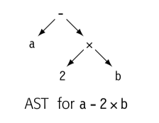
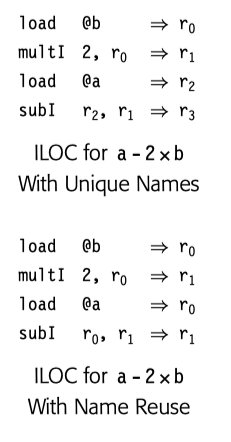
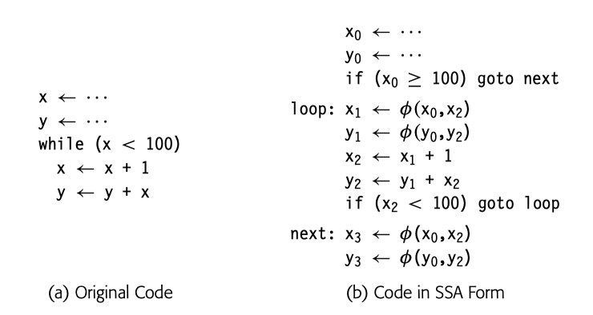

大多关于 name space 的讨论集中于源码的 name space: lexical scopes and inheritance rules. 同等重要的是，从编译代码的角度，编译创建 IR 的 name space .

IR 的 name space 与转换中的 memory model 相关。编译可以假设所有值都在内存，除非要在计算中被用到。也可以假设如果可能的话，所有值都在寄存器。

本节主要集中在 name space 设计，也会引入 SSA

## 4.6.1 Name Spaces in the IR

### Implicit vs Explicit Names

类树 IR 对于某些值使用隐式名字，比如下图 AST

就没有 `2 x b` `a - 2 x b` 的名字

相反，三地址码使用显式名字，给了编译器控制名字的能力。

这是使用唯一名字和重用名字的例子。

### Variables vs Values

`a <- 2 * b + cos(c / 3)` 表达式中，`a,b,c` 都可以在后续的 stmt 中使用，但是 `2 * b` 这种就不可以。

在 IR 形式的代码中，编译器开发者必须决定哪些值可以通过唯一显示的名字访问。就像上面的例子，可以尽可能多的使用名字，也可以名字重用，这个决策会很大程度上影响后续的优化。

给每个子表达式都使用唯一名字的诱惑是提供最大可能机会优化代码。然而不是所有子表达式都有用。如果只在一个 stmt 中使用，明显没有显示名字的必要。

## 4.6.2 Static Single-Assignment Form

SSA 是一种 naming discipline 的 IR ，很多现代编译器使用它来编码控制流和数据流。SSA 形式中，每个名字对应一个 definition。

fin-function 用来表示 merge 点

